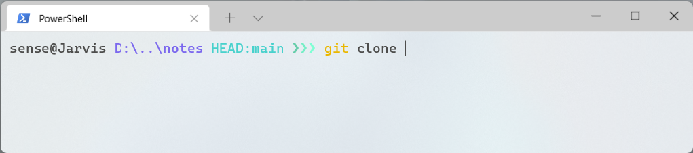

## 终端配置主题

### 工具安装

- [Scoop](./scoop.md)

- [Windows Terminal](https://www.microsoft.com/zh-cn/p/windows-terminal/9n0dx20hk701)
- [git](https://git-scm.com/downloads) | [posh-git](https://github.com/dahlbyk/posh-git) | [oh-my-posh](https://github.com/JanDeDobbeleer/oh-my-posh)

```powershell
# 添加软件源 功能依赖于 git，请确保电脑中已经安装 git
scoop install git
scoop bucket add extras

# 工具安装
scoop install posh-git
scoop install https://github.com/JanDeDobbeleer/oh-my-posh/releases/latest/download/oh-my-posh.json
```

### 主题配置

```powershell
# 打开配置
notepad $profile

# 在记事本中输入如下内容，xtoys为主题名
Invoke-Expression (oh-my-posh --init --shell pwsh --config "$(scoop prefix oh-my-posh)/themes/xtoys.omp.json")
# 更多主题 https://ohmyposh.dev/docs/themes

# 刷新当前主题
. $profile
```

```powershell
# powerline 字体可以通过在 scoop 里增加 nerd-fonts bucket 安装 nerd-fonts 来支持
# 比如说使用有 powerline 补丁的 hack 字体，powershell 原生的 terminal 不支持这些字体，所以请安装其他的终端模拟器来使用，比如 windows terminal
scoop bucket add nerd-fonts
scoop install Hack-NF
```

> 我的 windows terminal 主题颜色配置

```json
{
  "background": "#FFFFFF",
  "black": "#0C0C0C",
  "blue": "#0037DA",
  "brightBlack": "#000000",
  "brightBlue": "#4271AE",
  "brightCyan": "#61D6D6",
  "brightGreen": "#718C00",
  "brightPurple": "#8959A8",
  "brightRed": "#C8282B",
  "brightWhite": "#A4B4F2",
  "brightYellow": "#EAB700",
  "cursorColor": "#4D4D4C",
  "cyan": "#3A96DD",
  "foreground": "#4D4D4C",
  "green": "#13A10E",
  "name": "Tomorrow",
  "purple": "#881798",
  "red": "#C50F1F",
  "selectionBackground": "#D9D9D9",
  "white": "#CCCCCC",
  "yellow": "#C19C00"
}
```

## 终端配置代理

> 通过终端访问 github 等国外网站的速度感人，因此需要为终端设置代理来提高速度
>
> 假设代理地址是 `127.0.0.1:7890`

```powershell
# 设置代理
netsh winhttp set proxy 127.0.0.1:7890

# 查看代理
netsh winhttp show proxy

# 取消代理
netsh winhttp reset proxy
```

> 若无代理服务 可使用开源工具 [dev-sidecar](https://github.com/docmirror/dev-sidecar) 进行代理
